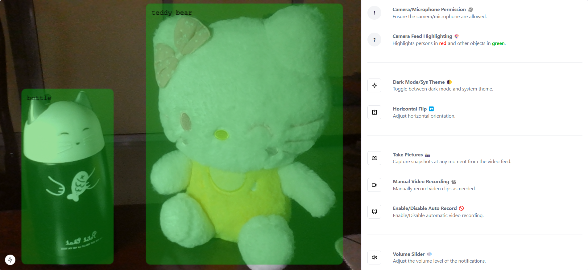

<div align="center">
  
</div>

<div align="center">    
    <h1>CAT GUARDIAN</h1>    
    <strong>Cat Guardian Tool</strong> ...
</div> 

## 📋 Table of Content 

1. [Introduction](#introduction)
2. [Getting started](#getting-started)
3. [Technologies Used](#technologies-used)
4. [UI Interface](ui-interface)
5. [References](#references)
6. [MIT License](#mit-license)

<!-- Introduction -->
## 🪧 Introduction <a name="introduction"></a> 
### 🔗 Link: [cat-guardian](https://chi-cat-guardian.vercel.app)

### 🛠️ Features:

- **Screenshot**: Capture snapshots of the webcam view instantly.
- **Recording**: Manually start/stop recordings or enable auto-recording mode.
- **Volume Monitoring**: Adjustable volume settings with 5 modes.
- **Mirror**: Flip the webcam feed for better viewing angles.
- **Change Theme**: Switch between light and dark modes for better visibility.

## 🚀 Getting started <a name="getting-started"></a>

### 🎯 Installation
1. **Clone the repository:**
     ```bash
     git clone https://github.com/chihiro-203/cat-guardian.git
     cd cat-guardian
     ```
2. **Install dependencies:**
     ```bash
     npm install
     ```

### 💨 Running the Application
1. **Start the application:**
     ```bash
     npm run dev
     ```
2. **Open in browser:**
Navigate to ```http://localhost:3000``` to access the application.

<!-- Technologies Used -->
## ⚙️ Technologies Used <a name="technologies-used"></a> 
1. __Text Editors/IDEs__: Visual Studio Code (VSCode)
2. __Browser for Testing__: Google Chrome
3. __Frontend__: Next.js, React, Tailwind CSS
4. __Computer Vision__: TensorflowJS
5. __UI Components__: Shadcn, Lucide Icons
6. __Tools__: Sonner (notifications), React Webcam
7. __Collaboration and Communication__: Github

## 🎇 UI Interface <a name="ui-interface"></a>
### 📽️ Tracking & Recording Panel:
<div align ="center">
    
</div>

## 📚 References <a name="references"></a>


## 📜 License <a name="license"></a>

This project is licensed under [MIT License](https://github.com/chihiro-203/cat-guardian/blob/main/LICENSE).
